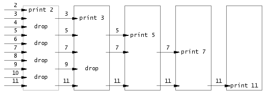

<h1>Xv6 and Unix utilities</h1>

In this lab, we gonna implement many interesting and useful programs like, `sleep, pingpong, primes, find, and xargs `. There are some points I want to emphasize, though this lab is not so hard.


<h2>Before Start</h2>

My experiment environment:

```
VM: VMware workstation
Linux ubuntu 20.04
```

 I can not find corresponding software in `apt-get` when my kernel was at 16.04 or 18.04, so I have to update to 20.04.


<h2>Lab</h2>

The structure we should know before programming is that, there are kernel's and user's code, when I need to do something on `system level`, we should call kernel's function. Gracefully, we have many wrapped interface on users' functions that we can directly call them. Check them in `user/user.h`

<h3>sleep</h3>

Skip

<h3>
    pingpong
</h3>

Note that in pipe[2], pipe[0] is for receiving data and pipe[1] is for writing into.

<h3>primes</h3>

The brief of this algorithm is used in the situation that, assume you have a bunch of machines, to find primes given a list of numbers which continuously +1 one after another. And each stage selects one minimum number and it is exactly prime, then verify other numbers do not have the prime as their factor. Then send left numbers into next stage...



Just use recursion to find next stage's number and send to the child's process


<h3>find</h3>

Refer to `user/ls.c`, that is a good template.

What I want to mention is some points of File System

**struct state** is the information a file descriptor refers to, stored in inode and can be fetched by fstat(fd, &st)

```
#define T_DIR 1 // Directory
#define T_FILE 2 // File
#define T_DEVICE 3 // Device
struct stat {
	int dev; // File system’s disk device
	uint ino; // Inode number
	short type; // Type of file
	short nlink; // Number of links to file
	uint64 size; // Size of file in bytes
};
```

**struct dirent** serves the same a file descriptor's information, but it mainly provides file's name

```
struct dirent
{
    long d_ino; /* inode number */
    off_t d_off; /* offset to this dirent */
    unsigned short d_reclen; /* length of this d_name */
    unsigned char d_type; /* the type of d_name */
    char d_name [NAME_MAX+1]; /* file name (null-terminated) */
}
```


<h2>xargs</h2>

This program helps me to understand xargs a lot, thanks gosh.

To implement `xargs`, we need first process `stdin` because `pipe` will redirect xargs's stdin to last program's stdout. When this done, we can user`exec()` to execute the command after xargs. Note that when processing stdin, we should read or gets byte by byte and when once encounter '\n', do command.


<h2>Conclusion</h2>

This programs helps me to review the usage of them and help me dabble into `fork(), exec(), pipe(), and file systems`


**Note:** when programming for a child process, just use `exit`

