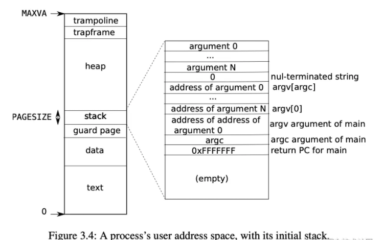

### Lab10 Mmap

In this lab,  we need to develop a `weak` `mmap(void* addr, size_t length, int prot, int flags, int fd, off_t offset)`, which have no designated `addr` and `prot` and `flags` are also limited to `READ, WRITE and both` and `SHARED and PRIVATE`. 

Also, we have to implement `munmap(void *addr, size_t length)`, which won't punch a hole in the middle of a region.

To make mmap fast return, we won't allocate any physical pages for a mmap call, and instead, we just put the call into a `vma` slot contains its meta information.

```c
struct vma{
  struct file* f; //file handler pointer
  uint64 vstart;  //start location in virtual memory
  uint64 length;  //File size
  uint64 offset;  //start location's offset
  int valid;      //Is this slot valid?
  int perm;		  //Permission : WRITE / READ
  int flags;      //MAP_SHARED / MAP_PRIVATE
}
```


In the lab website, lecturer has given us detailed information about how to write the code. And I want to introduce my design method which may be helpful to understand how to actually implement mmap.


I will throw some questions to help (you or me later) to understand why I do this

* Where to put `vma` in the memory?

```
At first I want to let vma increase with proc->sz, which means each time a mmap is called we need to reserve some `complete 4k size` in user memory to be physically allcoated. 
So I decided to put vma slots in the high space of heap
```



* When to allocate the physical page

```
In the mmap() call, we just select an empty vma slot and put this information into the slot then return.
When a page_fault is captured by usertrap(), if the accessing va is inside some vma. Then allocate a 4k page at va's page.
We should have a do_mmap() function like following:
```

```c
int do_mmap(struct vma* mmap, uint64 va){
  struct proc * p = myproc();
  printf("Current va :%p, perm : %x\n", va, mmap->perm);
  //Need to do the alloc first
  uint64 pa = (uint64)kalloc();
  memset((void*)pa, 0, PGSIZE);

  ilock(mmap->f->ip);
  if(readi(mmap->f->ip, 0, pa, mmap->offset + PGROUNDDOWN(va - mmap->vstart), PGSIZE) == 0)
    panic("do_mmap failed!\n");
  iunlock(mmap->f->ip);


  if(mappages(p->pagetable, va, PGSIZE, pa, (mmap->perm << 1) | PTE_U) < 0)
    panic("dp_mmap(): mappages()\n");
  printf("do_mmap() finished\n");
  return 0;
}
```

* When allocate a physical page, we need to implement our own `uvmalloc` function to set the permission flags.
* How to deal with munmap?
  * In this lab, we just need to deal with 3 situation:
    * free from beginning to some point before end
    * free from some point after start to the end
    * free all
  * What should we do while unmaping?
    * free whole 4k page if the entire 4k range is unmaped.
    * If the 4k is being freed, we have to write back the content if `flag` set as `MAP_SHARED`
    * If the beginning is free, we have to redirect `vma->offset` ,  so when read from file, the true `file offset` should be `va - vma->vstart + vma->offset`

```c
sys_munmap(){
    ...
  uint64 addr_aligned = ip;
  if(ip > v->vstart){
    addr_aligned = PGROUNDUP(ip);
    length -= addr_aligned - ip;
    //free not at head
    uvmunmap2(p->pagetable,addr_aligned, PGROUNDUP(length) / PGSIZE, v);
  }else if(ip + length >= v->vstart + v->length){
    //free all
    uvmunmap2(p->pagetable, PGROUNDDOWN(ip), PGROUNDUP(length) / PGSIZE, v);
  }else{
    //free at beginning, but not to the end
    if(PGROUNDDOWN(ip + length) > PGROUNDDOWN(ip)){
      uvmunmap2(p->pagetable, PGROUNDDOWN(ip), PGROUNDUP(length) / PGSIZE, v);
    }
  }
  if(ip <= v->vstart && ip + length > v->vstart){
    //modify offset
    v->offset += ip + length - v->offset; 
    v->vstart = ip +length;
  }
  v->length -= length;
  
  if(v->length <= 0){
    fileclose(v->f);
    v->valid = 0;
  }
  return 0;
}
```

* To deal with fork, although we copy vma from old to new, new pagetable won't have to the corresponding pte on it. Because it just copy the pte range from [0, p->sz].
* Don't forget to wipe out valid when proc is freed.
