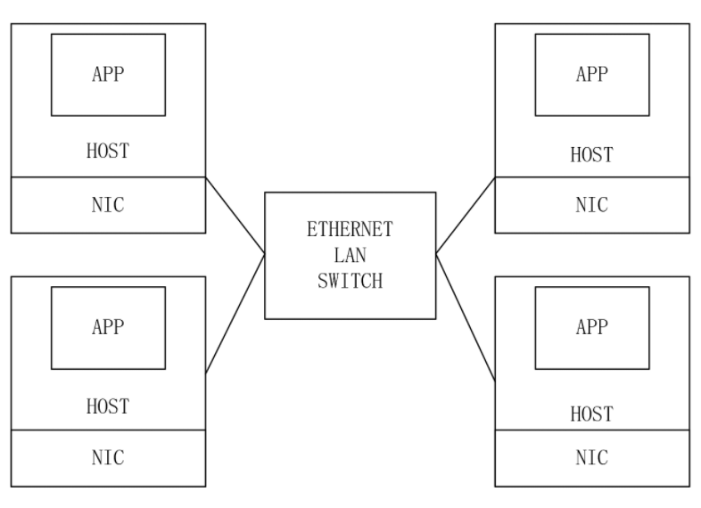
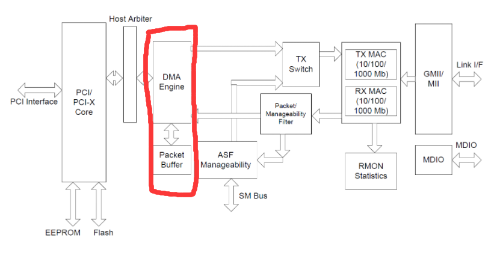

### Networking

In this lab, we will program on **NIC** driver to control packet receive and transmit process. Because the lab has a detailed description of how to do the lab, I'll just put on our code and explain some key points in the lab.


#### Code Part

```c
int
e1000_transmit(struct mbuf *m)
{
  //
  // Your code here.
  //
  // the mbuf contains an ethernet frame; program it into
  // the TX descriptor ring so that the e1000 sends it. Stash
  // a pointer so that it can be freed after sending.
  //
  acquire(&e1000_lock);
  int txport = regs[E1000_TDT];
  if(tx_ring[txport].status != E1000_TXD_STAT_DD){
    printf("haven't found a packet\n");
    release(&e1000_lock);
    return -1;
  }
  if(tx_mbufs[txport]){
    mbuffree(tx_mbufs[txport]);
  }
  tx_mbufs[txport] = m;
  tx_ring[txport].addr = (uint64)m->head;
  tx_ring[txport].length = m->len;
  tx_ring[txport].cmd = E1000_TXD_CMD_EOP | E1000_TXD_CMD_RS;

  regs[E1000_TDT] = (txport + 1) % TX_RING_SIZE;
  release(&e1000_lock);
  return 0;
}

static void
e1000_recv(void)
{
  //
  // Your code here.
  //
  // Check for packets that have arrived from the e1000
  // Create and deliver an mbuf for each packet (using net_rx()).
  //
  while(1){
    int next_idx = (regs[E1000_RDT] + 1) % RX_RING_SIZE;
    if(0 == (rx_ring[next_idx].status & E1000_RXD_STAT_DD)){
      break;
    }
    rx_mbufs[next_idx]->len = rx_ring[next_idx].length;
    net_rx(rx_mbufs[next_idx]);
    struct mbuf *new = mbufalloc(0);
    rx_ring[next_idx].addr = (uint64)new->head;
    rx_ring[next_idx].status = 0;
    rx_mbufs[next_idx] = new;
    regs[E1000_RDT] = next_idx;
  }
}
```


#### Network Architecture

##### Ethernet



Ethernet frame struct: start flag + 48 bits target eth address + 48bits source eth address + 16bits ether type + payload + end flag

```c
struct eth{
    uint8 dhost[ETHADDR_LEN];
    uint8 shost[ETHADDR_LEN];
    uint64 type;
} __attribute__((packed));
```

##### ARP

To transmit packet to remote Host, we need IP address and ARP protocol to translate IP address into eth address. ARP header is nested included in ethernet packet.

```c
struct arp {
  uint16 hrd; // format of hardware address
  uint16 pro; // format of protocol address
  uint8  hln; // length of hardware address
  uint8  pln; // length of protocol address
  uint16 op;  // operation

  char   sha[ETHADDR_LEN]; // sender hardware address
  uint32 sip;              // sender IP address
  char   tha[ETHADDR_LEN]; // target hardware address
  uint32 tip;              // target IP address
} __attribute__((packed));

#define ARP_HRD_ETHER 1 // Ethernet

enum {
  ARP_OP_REQUEST = 1, // requests hw addr given protocol addr
  ARP_OP_REPLY = 2,   // replies a hw addr given protocol addr
};
```


##### IP & UDP

```c
// an IP packet header (comes after an Ethernet header).
struct ip {
  uint8  ip_vhl; // version << 4 | header length >> 2
  uint8  ip_tos; // type of service
  uint16 ip_len; // total length
  uint16 ip_id;  // identification
  uint16 ip_off; // fragment offset field
  uint8  ip_ttl; // time to live
  uint8  ip_p;   // protocol
  uint16 ip_sum; // checksum
  uint32 ip_src, ip_dst;
};

// a UDP packet header (comes after an IP header).
struct udp {
  uint16 sport; // source port
  uint16 dport; // destination port
  uint16 ulen;  // length, including udp header, not including IP header
  uint16 sum;   // checksum
};
```


#### Kernel Network Stack


Each layer will stripe out and check the header according to the its own protocol from `mbuf` 's cached packet to achieve nesting.


#### MAC chip



DMA could directly visit memory without interact with CPU, **DMA Engine** controls PCI bus to transmit between memory and FIFO data buffer.

**Transmit steps:**

CPU put IP packet into memory and ask *DMA Engine* to do DMA transmit into *FIFO buffer*. Then MAC chip splits IP packet into *Data frame* whose size in range[64KB, 1518KB]. Each frame includes `Target MAC` `Source MAC` `Protocol type` `CRC checksum`.
