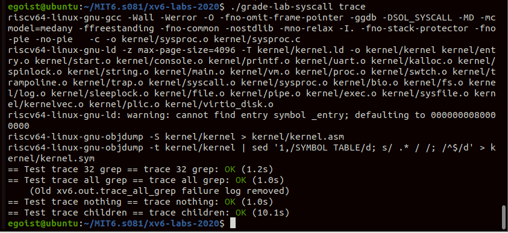
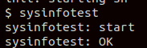

<h1>System Calls(pending the challenge)</h1>

In the lab, we will get deeper into OS than the previous one. We are about to implement the 'bridge' between user and kernel mode, then implement two specific `syscall` to be called by user's program.


<h2>Lab</h2>

The two labs are symmetry overall, so I just describe how to do a system call.

To make our own `syscall`s,we should know how the syscall works between user & kernel mode.

```
						   user function
							     ↓
					      wrapped interface
-----------------------------↓(ecall)--------------------------------------
						     syscall()
						     	 ↓
						kernel sys_(syscall's name)
```

In this framework, there are some points:

* How to use ecall?
  * We first declare a wrapped function in `user/user.h`, then implement it in `user/usys.S` which are assembly code generated by `user/usys.pl`, the assembly code are used to load the syscall number into `a7` register.
* In kernel mode how to fetch argument?
  * Refer to other functions in `kernel/sysproc.c`, we can use `argint()` in `kernel/syscall.c` to fetch argument from stack
* syscall() in `kernel/syscall.c` , what's its function?
  * It precedes after ecall, fetches the `a7` then executes corresponding syscall, then put the return value into `a0`


<h3> Trace</h3>

* Remember to put your new syscall number into every part a syscall can involve with, especially don't forget set the function point entry in `syscall.c`'s array.

* The function uses mask to mark all system call it wants to trace, so each bit on mask is a syscall you should check. Use `mask & 1 << syscallnum ` to check it.



<h3>Sysinfo</h3>

* The way kernel mode gives back argument to user mode is to call `copyout` which maps return args' virtual memory back to physical memory then revises it to target value.
* The collections of free memory and processes is not too hard, we can just iterate the freemem linklist and process array.



<h2>Conclusion</h2>

In this lab, we breakthrough the barrier between u/k mode, the whole detailed system call process is in front of us. But there are still many information we need to get into, `mmap, pages management , process management`, etc.


Also, I have not started challenges, because I am about to begin my graduate life in NUS, hopefully I can go back here and finish them someday!

