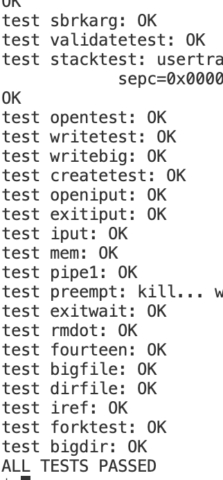

## Lab6 COW

### Copy-on-write on xv6
In this lab, we need to implement COW on xv6. The idea of the lab is quite straight forward but there are some subtle details
needs to be treated carefully.

Main idea of the lab, is to lazily allocate the physical page to child process. This lab takes almost 15h to debug (what fk), so I will give a detailed description of how I code and hope to give a rather clear idea.

* Firstly, define some utils functions to manipulate `refrence count table`
  * int get_ref(uint64 pa) // return reference count 
  * int dec_ref(uint64 pa) // decrease reference count
  * int safy_inc_ref(uint64 pa)  // do increment with lock
  * uint64 split_COW(uint64 pa) // return a new page according to the origin physical page
  
* Define a reference counting table, because physical page used for allocation starts from `KERNBASE`(not so accurate) to `PHYSTOP`.
  * so declear a array with `((PHYSTOP - KERNBASE) / PGSIZE)` elements.
  
* The reference counting scheme:
  * Decrease reference count in `kfree()`, once counting number <= 0 (may have negative number because in kinit() kernel will kfree() all pages first)
  * Set reference count = 1 in `kalloc()`
  * In the fork()::uvmcopy(), we should do reference increase
  * When actually split the COW-page, decrease reference of origin page and alloc a new page.

Once we decide the scheme, we could modify the uvmcopy() to let it map the new_pagetable to old pa.
```c
int
uvmcopy(pagetable_t old, pagetable_t new, uint64 sz)
{
  pte_t *pte;
  uint64 pa, i;
  uint flags;

  for(i = 0; i < sz; i += PGSIZE){
    if((pte = walk(old, i, 0)) == 0)
      panic("uvmcopy: pte should exist");
    if((*pte & PTE_V) == 0)
      panic("uvmcopy: page not present");
    *pte = ((*pte) | PTE_COW) & (~PTE_W);//modify the flags, add COW bit and remove W bit
    pa = PTE2PA(*pte);
    flags = PTE_FLAGS(*pte);
    //if((mem = kalloc()) == 0)
      //goto err;
    //memmove(mem, (char*)pa, PGSIZE);
    if(mappages(new, i, PGSIZE, pa, flags) != 0){//map old pa to new
      goto err;
    }


    safe_inc_ref(pa);//safely increase reference count
  }
  return 0;

 err:
  uvmunmap(new, 0, i / PGSIZE, 1);
  panic("uvmcopy goes wrong");
  return -1;
}
```
In the trap.c:usertrap(), we should handle the page fault like previous lazy allocation lab. So I just skip this part.  
Note the check condition should be:  
`va < p->sz && ((pte = walk(pagetable, va, 0)) != 0) && (*pte & PTE_COW) && (*pte & PTE_V)`

Then we do the COW split 
```c
int do_COW(pagetable_t pagetable, uint64 va){
  pte_t *pte = walk(pagetable, va, 0);
  uint64 pa = PTE2PA(*pte);
  int flags = (PTE_FLAGS(*pte) | PTE_W) & (~PTE_COW);
  uint64 newpage = cow_split(pa);//get new allocate page, maybe the origin page
  if(newpage == 0){
    //if out of memory
    return -1;
  }
  //unmap the origin physical page
  uvmunmap(pagetable, PGROUNDDOWN(va), 1, 0);
  //map the new page with COW remoed and W set
  if(mappages(pagetable, va, 1, newpage, flags) < 0){
    panic("do_cow(): mappages");
  }
  return 0;
}
```
Note we do the reference reduce in `cow_split()` and the new page's reference is set to 1 in `kfree()`

Finally let's check the `cow_split()`
```c
uint64
cow_split(uint64 pa){
  acquire(&reflock);
  if(get_ref(pa) <= 1){
    //If the page just have 1 reference, just return the origin page
    release(&reflock);
    return pa;
  }

  uint64 new = (uint64)kalloc();
  if(new == 0){
    //Out of memory
    release(&reflock);
    return 0;
  }
  memmove((void*)new, (const void*)pa, PGSIZE);
  dec_ref(pa); // reduce origin page refer
  release(&reflock);

  return new;
}
```
Just add some glue functions like `safe_inc_ref`, `dec_ref`... don't forget to modify `kfree() and kalloc()`. Then we are done!

#### Some hints
* Do get pa by `PTE2PA` macro and not use `addrwalk()` because it may return 0 if PTE_U not set.
* Use panic to decide some condition shouldn't happen
* Add locks to reference table, maybe you could try smaller granularity like give each index a lock...
