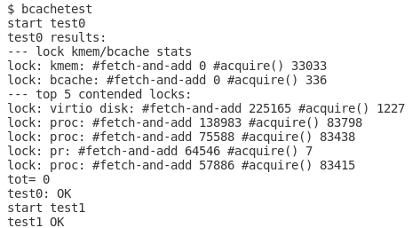

### Lab7 Lock

#### Memory allocator

This section is to make `kalloc` and `kfree` parallelly performed. The main idea is the free-list is shared among all CPUs so all CPUs need to serialize the allocation that we could improve this process by maintaining multiple `freelist` on different CPU.


Threads need to steal freepage from other CPU's if its freelist is null. Actually we could let process steal more pages to reduces the frequency of starve for freelist. But I just do the lazy programing and make process steal one page per time.


If you add lock properly, this lab won't be a big problem.


#### Buffer cache

Before starting the lab, xv6 book 8.2 to 8.3 section is definitely worthy reading. Namely, buffer cache is a layer between `disk` and `logging`  and its exposed API is `bwrite()` and `bread()`.  Because not like `kalloc` after allocation the page is in charge of single process,  bcache's buffer will be shared among all CPU and we can't split them.

So we should use finer-grain lock to reduce the frequency of contention. According to the suggestion in the lab website, we could use a hash table to mapping `<dev, blockno>` to `buf`. 

The new `struct bcache` should like following:

```c
struct {
  struct spinlock lock;
  struct buf buf[NBUF];
  // Linked list of all buffers, through prev/next.
  // Sorted by how recently the buffer was used.
  // head.next is most recent, head.prev is least.
  //struct buf head;
  struct buf bucket[NBUCK];
  struct spinlock hashlock[NBUCK];
} bcache;
```

We need to modify two main functions, `bget` and `brelse` to acquire more parallelism .

There are two tricky point to write the correct code.

#### Ver1

Firstly, give a naive scheme:

```
value := get_hash(dev, blockno);
acquire(hash_table[value]'s lock);
if no cache found
	acquire other hashtable's lock
	iterate other hash_table to grap idol buffer
```

If we acquired lock in the line2 and want to do iteration in line 4-5, it may cause deadlock. 

```
Assume block b1 hashs to 2, b2 hashs to 5
They all not be cached
----------------------------------------
CPU1                  CPU2
----------------------------------------
bget(dev, b1)         bget(dev,b2)
    |                     |
    V                     V
Acquire 2's lock      Acquire 5's lock
    |                     |
    V                     V
iterate all buckets    iterate all buckets
    |                     |
    V                     V
  ......                
    |                trying to acquire bucket2's lock
    |                     |
    V                     V
                    held by CPU1, wait...
trying to acquire bucket5's lock
    |
    V
held by CPU2, wait.,.

!Dead lock!


```

To solve this problem,  recall 4 conditions of deadlock:

* Mutual exclusion
* Hold and wait
* No preemption
* Circular wait

We can't solve this deadlock by destroying `mutual exclusion`, `no preemption` and `circular wait` . Here gives an example of `circular wait`, because we have to iterate through all buckets to find an empty buffer, we can't give a perfect order of visiting to avoid deadlock.

#### Ver2

**So the only option is before acquiring other bucket's lock, release current lock first.**

But it comes with new problem, the window between the release and acquire is unsafe. It will cause two different threads seek for the same `<dev, blockno>` in two different empty buffer which violates rules. So we still have to lock.

Given the following pseudo-code:

```c++
value := get_hash(dev, blockno);
acquire(hash_table[value]'s lock);
if no cache found
    release(hash_table[value]'s lock)
    //dangerous window
    acquire(bcache's lock)// Note the sequence of release and acuquire
	acquire other hashtable's lock
	iterate other hash_table to grap idol buffer
```

Note we should release() then acquire whole` bcache's lock`. If not may cause deadlock, for the similar reason that maybe exits one scenario that one process holds `hash_table[value].lock` and waits for `bcache.lock` and another process holds `bcache.lock` and waits for `hashtable[value].lock` in the later iteration.

#### Ver3

The window between release() and acquire() still have race condition, for the same reason and consequence mentioned in previous version. But since we lock the whole `critical area` from line. 7,  no two threads will in line7-8 simultaneously,  so we just need to check the `hash_table[value]` if a block is used at the beginning of acquire `bcache's lock` to keep synchronized.

```c
value := get_hash(dev, blockno);
acquire(hash_table[value]'s lock);
if no cache found
    release(hash_table[value]'s lock)
    //dangerous window
    acquire(bcache's lock)// Note the sequence of release and acuquire
    //Check another round        
    check if cache found
	acquire other hashtable's lock
	iterate other hash_table to grap idol buffer
```


#### Some hint

* In multithreading programming,  we could start with a coarse grain lock then reduce granularity step by step to meet the performance requirement.
* Once we want to hold two lock at one time, think carefully about ordering. (If somewhere exists a opposite acquiring sequence)
* Do transaction without lock, and before submitting we check the data consistency. If have a conflict, then we need handle this situation -- Our design used this scheme which called Optimistic locking.



