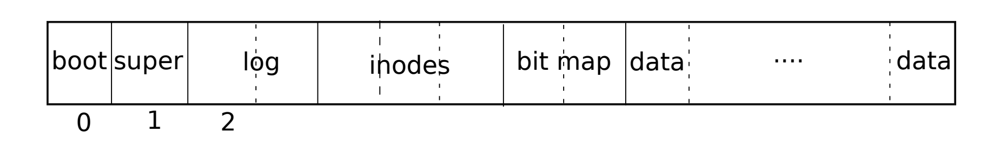
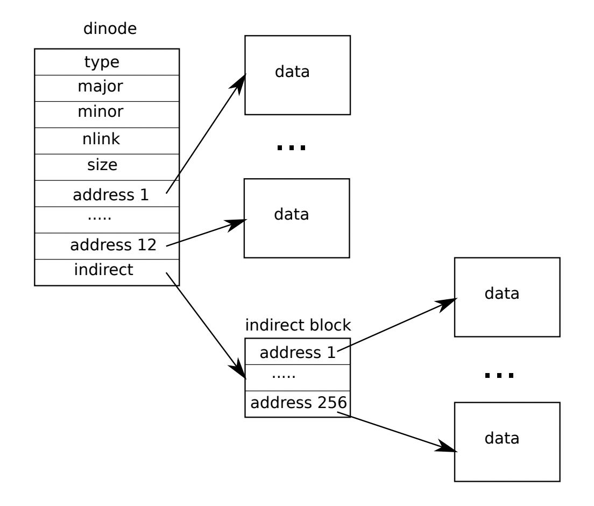

## File system on xv6

### File system features
* Abstraction
* Crash Safety
* Disk Layout
* Performance -> Because storage are slow

### File system structures
```c
struct inode{
    file_info;
    name;
    inode_num;
    link_count;
    open_fd_count;//File can only be deleted, if above two are 0
};
```


```
inode cache -> mostly for synchronization     ↑
logging                                       ｜
buffer cache                                  ｜
--------                                      ｜
disk                                          ｜
```

#### Start with storage devices
CPU communicates to disk by PCIe, once the read/write is done, the driver will yield an interrupt. And thank to driver, in fs's perspective, disk is like a long array

inode structure on xv6:


#### Directory
In the file system, directory <=> file.
In xv6, directory entry is like:
```c
struct dirent{
    inum;
    filename char[15]
}
```

To find a file in the directory, xv6 needs to scan over the block to match the filename. Then pickup `inum` as the inode block index.

Practically, we could use more efficient data structure to get better performance.


#### Crash Safety
On multi-step operation system, if crash happens during inside the transaction, we need to make sure on-disk data.  
General solution -- logging.

Risks:
* fs operations are multi-step **disk** operation
* Crash may leave fs invariants violated. -> need to be atomic
* After reboot, fs may immediately crash agian or no crash, but r/w incorrect data.

General solution -- Logging:
* Atomic fs calls
* fast recovery
* high performance

Logging process:
* Log writes
* Commit op
  * Note disk have a presumption that a single block or sector write  should be atomic. Namely the sector will never be written partially.
* Install  <-  the installation should be idempotent
* Clean log

The advantage in logging is to make the transaction atomic, either we install all of operations or install nothing.  

API of xv6
```c
void log_write()// write the log.lh.block[i] as the modified block number index, namely marked the blocknumber
void write_log()// copy modified blocks from cache to disk log, 
void write_head()// write header to disk -- the real commit timing
```
If the crash happens after `logheader` is write, then when rebooting, xv6 will find the header block and check the `log.lh.n`, if it's not zero, then we will do the recoverey to install `log block` into `actual block`

#### Challenges
* Evict
  * If bcache is full and needs to do eviction, we shouldn't do eviction od a dirty block page
  * Because some pages may still inside of a transaction, so we shouldn't evict these pages.
    * The way xv6 uses, is to `pin` the block by manually incrementing the page reference. And decreasing while commiting

* FS op must fit in log
  * xv6's log is 30 blocks, which fs operation must fit in 30 blocks before committing.
  * The solution is to split a big size of writing transaction into many small writes.
  * A question: Why we don't require a huge atomic transaction, what if the system crashes during many small writing transaction?
* Concurrent fs calls
  * If many fs calls happen at the same time, we have to make sure all concurrent ops must fit into log blocks
  * The way xv6 solves it is to limit the number of concurrent fs call.
    * If the transaction number exceeds limit, it falls into sleep until other transactions are done.
    * And all the other concurrent fs calls maybe commit together, called `group commit` as a single big transaction commit
  * A more general way maybe before adding one more fs transaction, do block number size check first.
