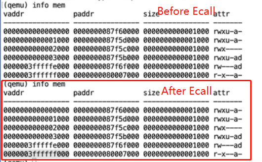

## Lec6- Isolation and syscall

### Supervisor registers
* stap -- Store the page table's base address
* stvec -- Store the address of trap program -- `trampolines`, note that this address is mapped on user's page table but without `PTE_U` which means the user can't modify it.
* sepc -- Store the address in the user mode when ecall happens
* sstrach -- Store the address of `trapframe` which stores a frame useds to temporarily keep the user's registers. Also used as swap "transfer station" register. 
    * See the usage of `csrrw a0, sstrach, a0` in the trampoline.S for some examples.


### Work Flow

```
							user_syscall()
							    ecall
	------------------------------↓----------------------------------
							uservec-trampoline        userret()
								  ↓                     ↑
							  usertrap()           usertrapret()
							      ↓                     ↑
							   syscall()   --------------
							     ↓  ↑
						    specific SYS_call()
```


Some interesting features:

* When user functions use ecall trying to enter kernel mode, what the RISCV actually does is just fetch the address at `stvec` and jump to that address and execute.

  * Ecall fetches the value from `stvec` and saves the `pc` in the `sepc`.

  * You shall see the page table haven't been changed after ecall.

  * `stvec` register keep the address of `trampoline`

  * The last two line in the page table are exactly the kernel mode's code, but mapped at user's page table. Note PTE_U are not set, so user mode can't access them.

    

* `trampoline` are the two-direction bridge for both user and kernel, because its physical address for user and kernel are both map to the same virtual address.

  * Based on above handy design, we could do `satp` change and save 32 register into `trapframe`.

  * Note that `sstrach` initially store the address of `trapframe` then swap the content with a0.
  * Finally load kernel stack pointer and usertrap address then jump to kernel c code.

* `trap.c` checks the reason of the trap and redirect the following trap to jump tp `kernelvec` instead of trampoline. Then it analysis the cause number (in lecture's example, we use syscall, so # is 8)

  * For syscall, what `usertrap()` does is jump to syscall() function and syscall() will change the trapframe->a0's value to make it received by user as the return value.

