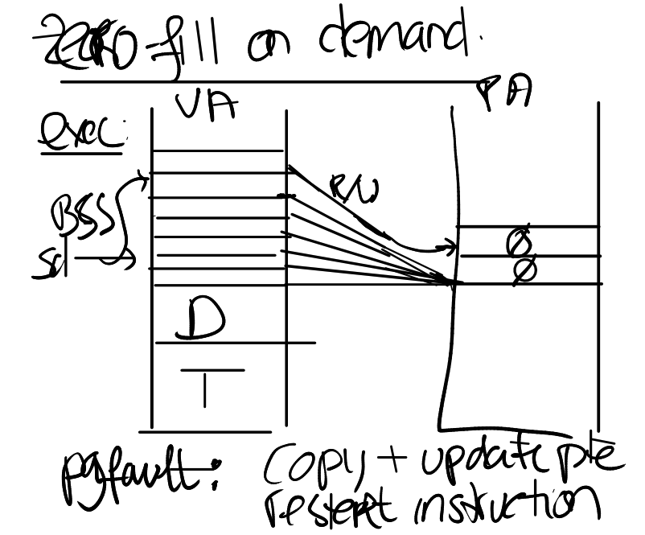
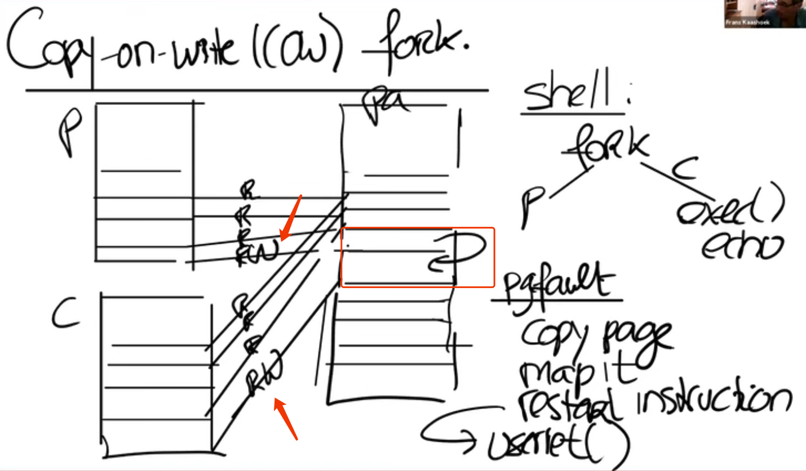

## Page Fault

### Virtual Memory
Two advantages:  
* Isolations: Because of the exist of `satp`, two different processes can't visit other's physical memory
* Memory Indirection: The mapping from va -> pa, provides us many interesting features like, page fault, demanding, lazy allocation...

### srbk()
Grow(or shrink) the heap from lower to higher place(or h -> l)
Two allocations methods:  
* Eager Allocation: Allocate the memory immediately once srbk() is called.
* Lazy Allocation: Allocate the memory only when the memory is used(writed).

But the situation is that many programmer don't know the exact space they need, so they tend to allocate the maximum space. -> lazy allocation is better.  

In xv6, lazy allocation should just bump up the p->sz and only alloc() space when the page is needed.

### zero-fill on demand

In the convention of c language, `bss` which stands for `block starting symbol` is the portion of an object file that contains statically allocated variables that are declared but have not been assigned value yet.  

So the lazy allocation could do is that, in the virtual address there might be many BSS pages, and we could page them to one same page on physical memory(one zero page).

Once a bss page requries to write something on the page, the kernel yields a page fault and allocate a new physical all-zero page then remap the va to this page then return to user.

Pros:
* Similar to lazy allocation(space saving)
* Quick execute because don't have to initialize many pages at beginning.

### copy-on-write fork

The basic idea is the child process and parent process are sharing the same physical address at beginning.  

At somepoint once child/parent wants to do some modification on one page(let's assume child). The kernel will detect the access to the physical page and try to allocate a new page copy for the child, (because in fork() all pages' PTE are set to READ_ONLY, the write acess will cause trap
). After the allocation, this specific va of child and parent's PTE will be READ & WRITE as normal.

### Demaning page
In exec(), we could load `text and data` not so eagerly that we can just set the virtual address but leave PTE_V as 0. So once the page is visited, it will yields a page fault then the kernel finally load the page from disk.

* Set page table, PTE_V = 0
* After page fault
  * read block/page from file into memory
  * map the memory into pgtbl
  * restart instruction

Then we may also get into  out-of-memory situation, so LRU and other eviction policies may be involved.

### Memory-mapped files

mmap(va, len, protection, flags, fd, off)  
unmap(va, len) 

do this lazily by store the mmap in `vma` (virtual memory area) maintains `fd, prot, va, off...` .