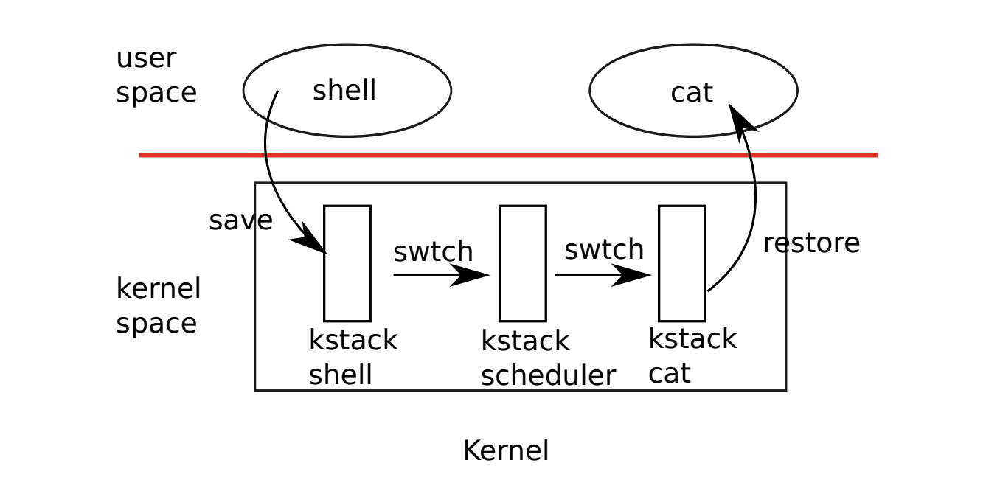

## Thread Switch
This lecture talks about xv6's mechanism of thread switching.  
### Background knowledge
Thread : one serial execution, it should have its own `pc`, `registers` and `stack`. The scheduling system focus on the interleave multiple threads. There are two main methods to get this done, the first is using multi-cores and the second is to switch.

To deal with a computation-bound program which takes a long run to finish the job, the scheduling system uses `timer interrupt` to pre-empt the kernel then switch to another process.
* In xv6, the scheduling does is first pre-empt the kernel then voluntarily yields cpu to other process.


* Recall the workflow of interrupt. Trampoline.S stores all registers and pc in trapframe.
* Sometimes, in kernel, `kernel thread` just does a simple syscall and returns back to user thread by restore `pc`.
* But sometimes, kernel decides to swtich to other thread.
  * The kernel thread should save its own state, we call it `kernel context`, includes kstack and kernel registers.
* Two time to make context switch -- time interrupt and IO waiting.

### What xv6 does
Actually, xv6's the kernel context switch is conducted by `scheduler thread`, means kernel thread first switch to a middle thread then it chooses which process to run next.  
The stored states includes `kstack pointer and pc`. Once the scheduler switch next process, it also has its previously stored states to be reloaded.
* The scheduler is pin to each CPU, so it exactly chooses which runs on the CPU
* Kernel context is stored in p->context.
* Scheduler's context is stored on the structure CPU for that core.
* Important, one core could just run one thread at one time and one thread can only run on one core at one time.

### scheduler
swtch function store the current thread's context, includes `ra, sp...` etc.  then load the target thread context.  
one process kernel thread -> sched() -> swtch to scheduler() -> find a runable thread() -> swtch() -> other process kernel thread

#### Some thoughts
* Each child process are set a fake ra in allocproc(), because it needs a `ra & sp` to be switch to and execute to set p->trapframe->epc = 0 in forkret()
  ```c
  // Set up new context to start executing at forkret,
  // which returns to user space.
  memset(&p->context, 0, sizeof(p->context));
  p->context.ra = (uint64)forkret;
  p->context.sp = p->kstack + PGSIZE;
  ```
* In xv6, even in the scheduler, the kernel turns on the interrupt to provent kernel from deadlock.