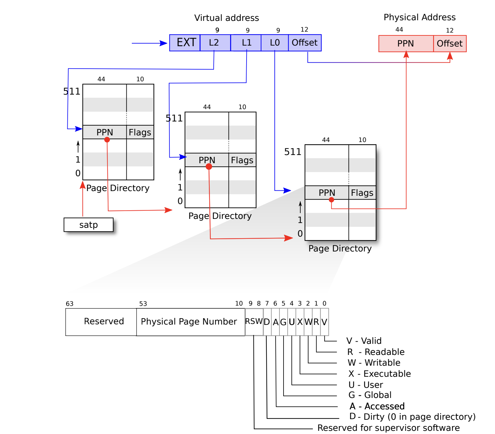
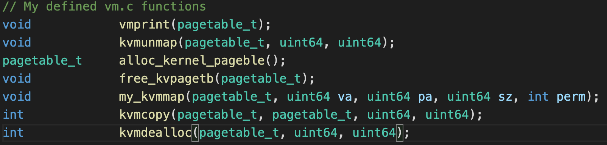

## Lab3 pagetable
 In this lab, we will modify the pagetable, and finally be able to dereference pointers in the kernel mode.

 ### Lab1--Print page table
 In this lab, it's much easier than later two lab that we just need to write a DFS recursive function to walk down the 3-level pagetable and print out the path.  

Check `vm.c/freewalk()` and dfs the pagetable, note the format of a `virtual memory address`.

We should notice that different from intel's pagetable, xv6 store the PPN at high 44-bit.
So normally we need the `PTE2PA` marcos to convert this pagetable content into physic address by shifting over bits.

Once we get to the lowest-level, we should know that non-leaf nodes have non-setted PTE_W, PTE_R, PTE_X flags (We could use them to detect wheather leaf nodes)

### lab2--Kernel page table per process
This lab is used to prepare us for lab3, which needs make user mode's pointers deferencable in kernel mode.
We should not just keep a pointer of global `kernel_pagetable` in each process because xv6 support multi-process concurrently run in kernel mode. Thus we need a real copy of kernel page table per process.  

So we firstly need add a new member variable in the `struct proc` to record its own kernel page table pointer. Then follow `vm.c/kvminit()` to initialize the this `knpagetbl`.  

Modify the `vm.c/kvmmap()` function to make it accept one more arguement `pagetbl`, this function is used to map a va into a pa on one page table.  

Modify the `vm.c/kvmpa()` function to make it accept one more argument `pagetbl`, used to walk down the page table and find the va's corresponding pa.  

And we also need mapping kernel stack for each process, note that originally xv6 just keep one kernel page table, so it need to record `NPROC`'s kstack mapping to be accessed by `NPROC`'s processes. But as we implement the kernel page table for each process, the private kernel page table just need record one kernel stack‘s virtual address points to different physical address. Delete the kernel stack initialization code on `proc.c/procinit` and do the kstack init on `proc.c/allocproc`. Note that we could map kstack va on the place because the va is private to each process.  

Modify the `vm.c/schedular()` to load the private kernel, (see `vm.c/kvminithart` ), don't forget change the satp register back and clean the TLB.

Free the kernel page table and kstack (Important!), we could imitate `vm.c/freewalk()` but remember not do free on the real physic pages. And we need to do free kstack first before we free the kernel page table.

### Lab3--Simplify copyin/copyinstr

In the original xv6's implementation, if we want to dereferen a user's pointer, the kernel needs simulate the walk down process which should be done by MMU and TLB. (see vm.c/walk()). If we could directly dereference the pointer, this process could be accelarated by the hardware.  

The main idea is to make every modification on user's page table reflect on kernel page table. So we firstly need two functions --   
`kvmcopy(pagetable_t src , pagetable_t dst, uint64 va, uint64 len)`  
`kvmdealloc(pagetable_t pgtbl, uint64 oldsize, uint64 newsize)`  

Note that in the user mode, virtual memory always grow from 0, (see exec.c/exec() for how va grows), which means if we need to free the memory, we should free from [0, p->sz].  

Then for every user page table modification, do mapping to private kernel page table in (`exec(), fork(), growproc(), userinit()`). Note that in the `growproc`, the function does not only handle the grow but also shrink of mem, so we need use the `kvmdealloc` to shrink the kernel page table as well..

**Some Hints** 
* After xv6 is booted, the address is at 0xC000000, which is the address of the PLIC register, so user's page table should not exceed this address. Add a p->sz check statement in `exec()`.
* For the same reason, note that CLINT address is under 0xC000000, so do not map this address on the private kernel page table, but we should do so on the global page table.
* Don't forget free kstack pointer in the `freeproc()`
  
  